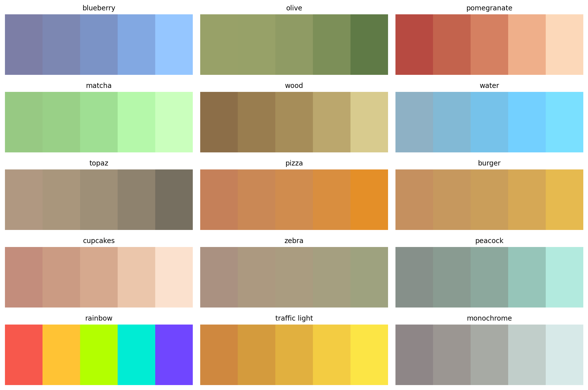
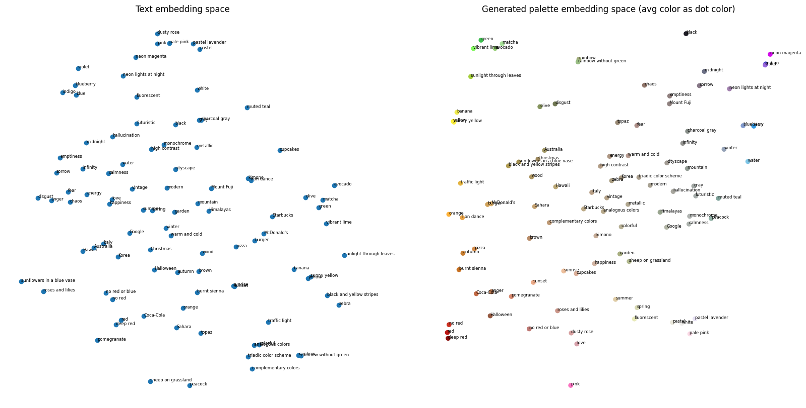

# PaletteLab

PaletteLab is a project that explores AI-driven color palette generation. It is designed to support multimodal inputs, including text, images, and palettes. At present, only text-to-palette generation is supported.

## Examples


See results for all test prompts [here](examples/palette_generation_test_prompts.png).

## Installation

### Prerequisites

- Python 3.10 or higher
- PyTorch 2.7 or higher

### Setup

1. Clone the repository and enter the directory

```bash
git clone https://github.com/oakoat/palettelab
cd palettelab
```

2. If you have an NVIDIA GPU, install a CUDA-enabled PyTorch build. CPU-only users can skip this step.

```bash
pip install torch==2.7.0 torchvision==0.22.0 --index-url https://download.pytorch.org/whl/cu126
```

3. Install other dependencies

```bash
pip install -r requirements.txt
```

## Usage

Check out our [HuggingFace space](https://huggingface.co/spaces/oakoat/palettelab).<br>
You can also use PaletteLab locally via a notebook or Gradio web interface. Download the [model weights from Hugging Face](https://huggingface.co/oakoat/palettelab) or allow the scripts to download automatically (default behavior).

#### Notebook

1. Open [`run.ipynb`](inference/run.ipynb).
2. Locate the cell that defines `use_local` and configure variables as needed.
3. Locate the cell that defines `text_prompt` and configure variables as needed.
4. Run the notebook.

#### Gradio

- Run the following command:
```bash
python -m gradio_app.app
```
- If you manually download the model weights, run the command with `--model` argument:
```bash
python -m gradio_inference.app --model [model.path]
```

## Pipeline

### Overview

The current text-to-palette model is primarily a conditional transformer decoder. The high-level workflow is as follows:

1. **Text encoder:**
   A pretrained [CLIP](https://github.com/openai/CLIP) model is used to produce text features and is largely frozen. The text features are projected into the model's latent space using a MLP (`text_proj`) and serve as decoder inputs.

2. **Palette encoder:**
   Palettes, represented in normalized LAB color space, are embedded using a MLP (`color_embed`). These color embeddings are also used as decoder inputs.

3. **Transformer decoder:**
   An autoregressive `nn.TransformerDecoder` generates the palette conditioned on the projected text features. A learned BOS token is prepended to the palette sequence. Sinusoidal positional encodings are added to inject sequence position information.

4. **Stochastic conditioning (`z`):**
   A noise vector z ~ N(0,I) is sampled per sequence, projected via a learnable `z_proj`, and added to the decoder inputs.

5. **Per-step heads:**
   Two output heads predict L (via sigmoid) and ab (via tanh) values for color generation.

#### Stochasticity

During training, stochasticity is introduced through noisy teacher forcing on palette inputs and stochastic conditioning. This helps regularize the model, improves robustness to small color variations, and prevents overfitting to exact palette configurations.

During inference, stochasticity arises from stochastic conditioning and per-step color sampling. This allows the model to generate diverse palettes for the same text prompt. Both sources of randomness can be disabled to produce deterministic palette generation.

### Loss Function

The loss function is a weighted combination of:

- Mean squared error (MSE) loss for per-color reconstruction accuracy
- Hungarian matching loss for evaluation independent of color order

The relative contributions of each term are controlled by scalar weights (see `configs/config.yaml`).

## Dataset

The training dataset was curated from multiple online sources in January 2026. After pruning entries containing uncommon words not included in this [English word database](https://github.com/dwyl/english-words), the dataset contains 98,863 text-palette pairs. Approximately 95% of the entries are palettes of 5 colors. The training dataset is not released.

## Training

The model was trained for 20 epochs, and achieved its best validation loss at epoch 11. The weights from this epoch were selected as the published model.

## Results

Across a wide range of prompts, the model generates palettes that are visually coherent and semantically aligned with the input text. However, some palettes are not aesthetically pleasing and contain highly similar colors. Performance is strong on prompts that explicitly reference color names, but degrades on linguistically complex prompts involving compositional reasoning or negation.

### Embeddings

Embeddings of test prompts and their generated palettes are visualized using t-SNE. Text embeddings (from the CLIP-based text projection) and palette embeddings (mean-pooled color embeddings) are projected separately.


In the palette embedding space, the color of each point corresponds to the average color of the associated palette.<br>
#### Key observations:

- Prompts suggesting high-saturation color themes form tight, well-defined clusters in both text space and palette space, including green, yellow, and blue themes.

- Muted and neutral prompts appear more dispersed.

Overall, the cluster structure is largely preserved from text space to palette space. The model maintains semantic organization while mapping language to color.